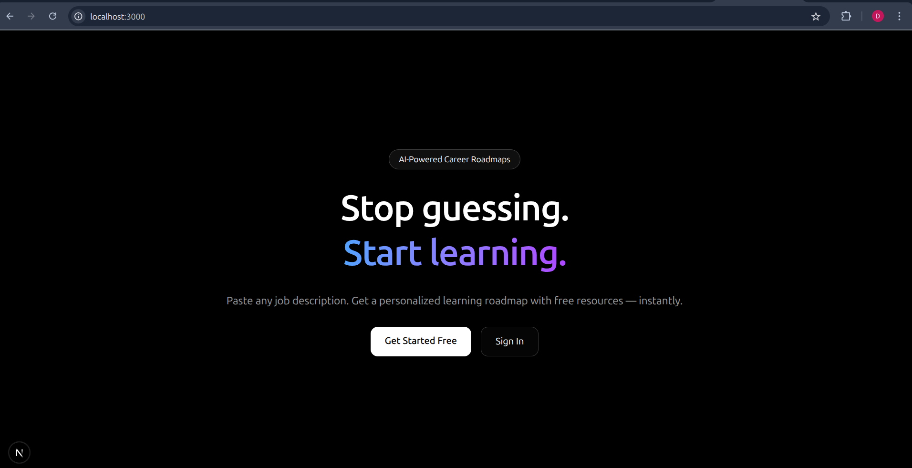
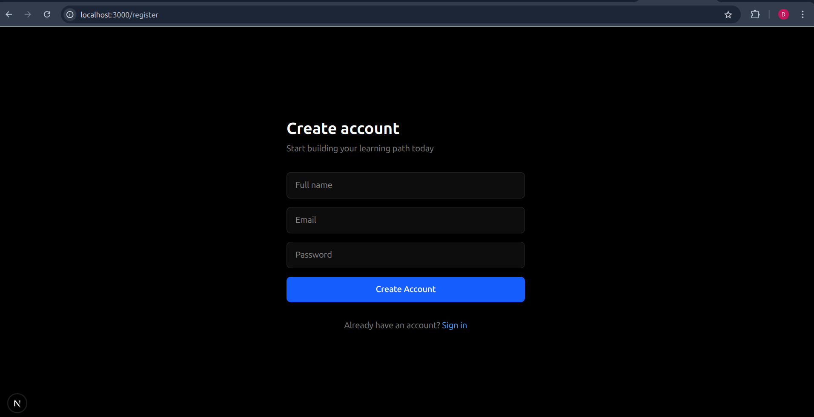
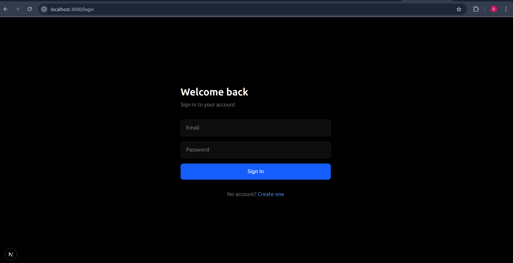
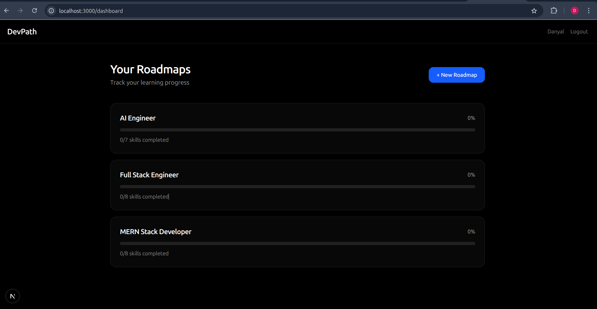
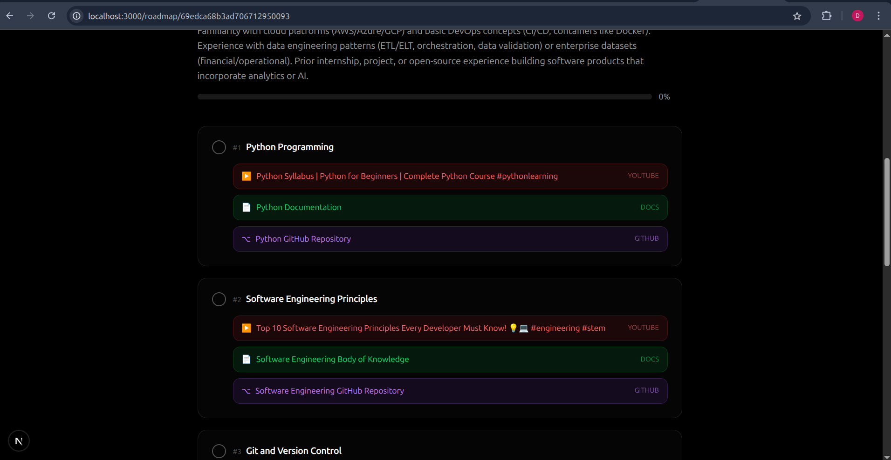
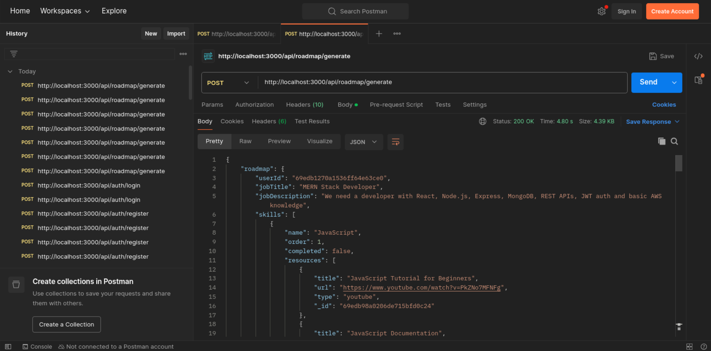

# DevPath 🚀

**Stop guessing. Start learning.**

DevPath is an AI-powered career roadmap generator. Paste any job description and instantly get a personalized, ordered learning path with free resources — YouTube tutorials, official docs, and GitHub repos — for every skill you need.

Built for self-taught developers who are tired of not knowing what to learn next.

---

## Features

- 🤖 AI-generated roadmaps from any job description
- 📚 Free learning resources per skill (YouTube, Docs, GitHub)
- ✅ Progress tracking — mark skills as complete
- 📊 Visual progress bar per roadmap
- 🔐 JWT authentication

## Tech Stack

- **Frontend** — Next.js 14, Tailwind CSS
- **Backend** — Node.js, Express, MongoDB, Mongoose
- **AI** — Groq API (Llama 3.3 70B)
- **YT_DATA** — YouTube Data API v3
- **Auth** — JWT

## Getting Started

```bash
git clone https://github.com/0xdanyal/devpath
cd devpath
npm install
```

Create a `.env.local` file:

```env
MONGODB_URI=your_mongodb_uri
JWT_SECRET=your_jwt_secret
GROQ_API_KEY=your_groq_api_key
YOUTUBE_API_KEY=your_youtube_api_key
```

```bash
npm run dev
```

Open [http://localhost:3000](http://localhost:3000)

---

Built by [Danyal](https://linkedin.com/in/danyal-dev) — a self-taught developer from Islamabad, Pakistan.

## Screenshots

### Landing Page


### Register Page


### Login Page


### Dashboard


### Roadmap Page


### Postman Testing APIs
